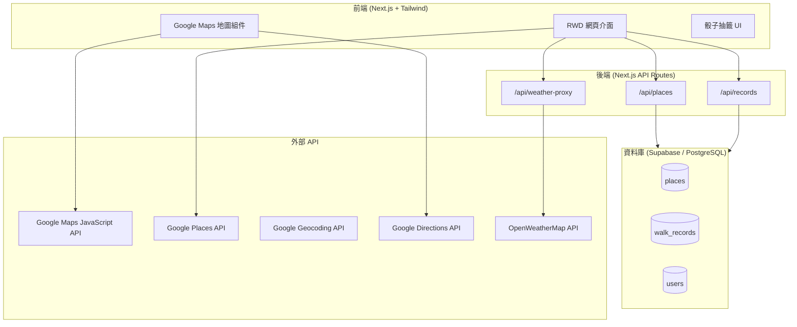
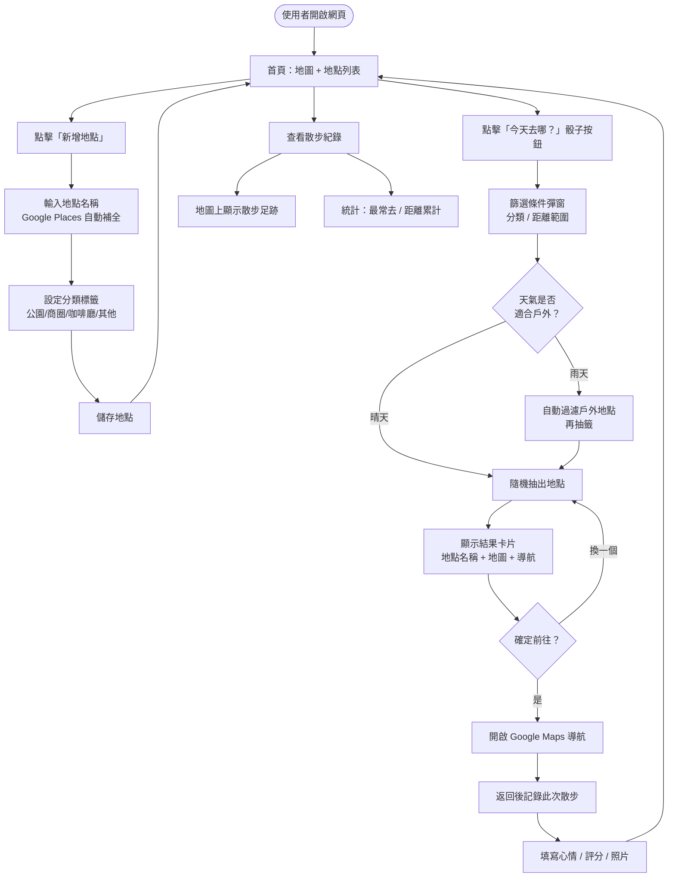
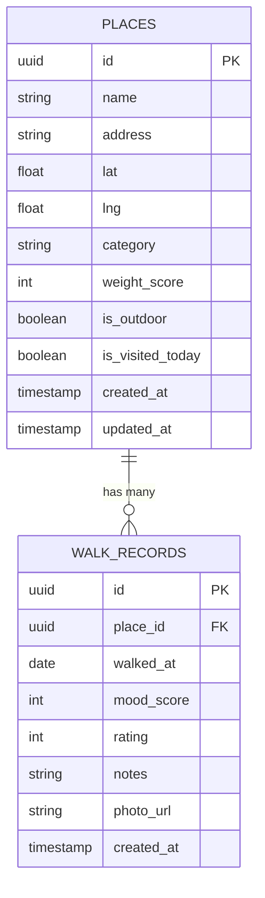
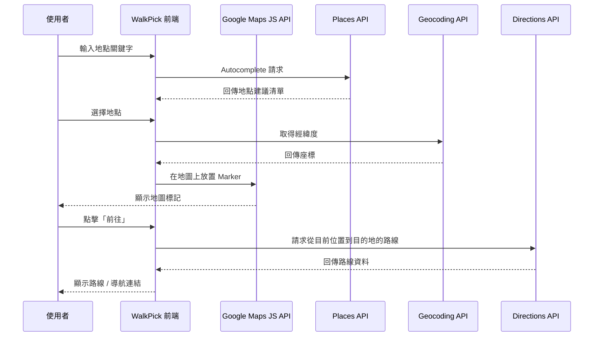
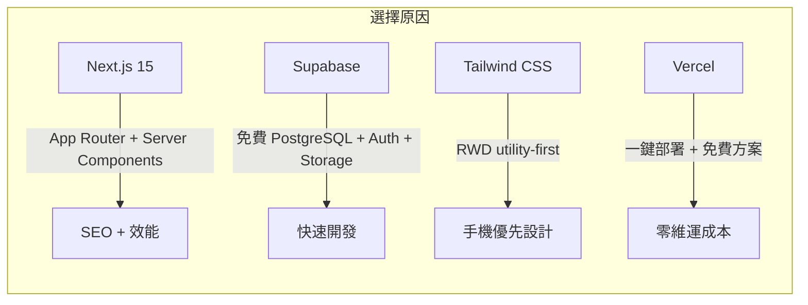
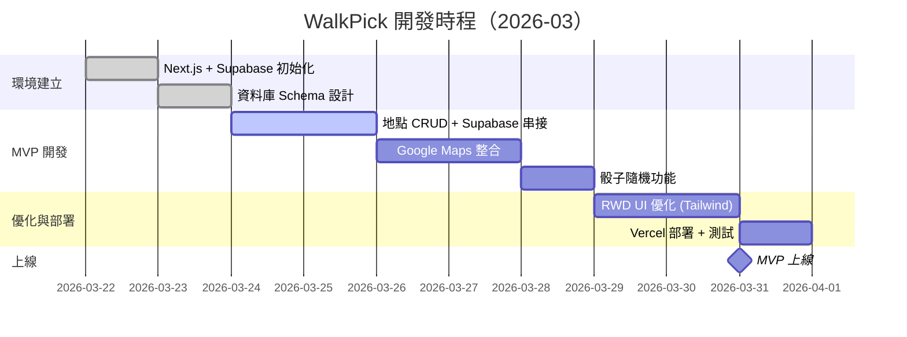

# PRD：散步地點隨機抽籤系統（WalkPick）

## Context
使用者希望建立一個 RWD 網頁應用，解決「選擇障礙」問題——可以管理自己去過或想去的地點，並透過隨機骰子功能抽出今天要去散步的地方。整合 Google Maps API，提供視覺化地圖體驗。目標三月底上線 MVP。

---

## 1. 產品概覽

| 項目 | 內容 |
|------|------|
| **產品名稱** | WalkPick |
| **目標用戶** | 個人使用者，有選擇困難、喜歡散步探索 |
| **平台** | RWD 網頁（桌機 + 手機） |
| **技術棧** | Next.js 15 + Supabase + Google Maps API + Tailwind CSS |
| **部署平台** | Vercel（免費方案） |
| **目標上線日** | 2026-03-31（MVP） |

---

## 2. 系統架構



---

## 3. 使用者流程



---

## 4. 資料模型



---

## 5. Google Maps API 整合計畫



---

## 6. 功能清單（MVP vs 進階）

### MVP（三月底上線）

| 優先級 | 功能 | 說明 |
|--------|------|------|
| P0 | 地點 CRUD | 新增、編輯、刪除地點，含分類標籤 |
| P0 | Google Maps 顯示 | 所有地點顯示在地圖上，可點擊 |
| P0 | Places Autocomplete | 輸入地點名稱自動補全 |
| P0 | 骰子隨機抽籤 | 可按分類篩選後隨機抽出 |
| P1 | 今日已去標記 | 避免當天重複抽到同一地點 |
| P1 | RWD 手機介面 | 手機操作體驗優化 |

### 進階功能（上線後迭代）

| 功能 | 說明 |
|------|------|
| 散步紀錄 | 每次散步的日期、心情評分、照片 |
| 距離篩選 | 根據 GPS 位置只抽「N km 內」地點 |
| 天氣整合 | 串接 OpenWeatherMap，雨天自動過濾戶外地點 |
| 加權骰子 | 高評分地點有更高機率被抽到 |
| 足跡地圖 | 在地圖上顯示歷史散步路線 |
| 統計頁面 | 最常去地點、總散步次數、累計距離 |
| 分享功能 | 產生分享連結讓朋友使用同一清單 |

---

## 7. 技術架構決策



---

## 8. 里程碑與時程



---

## 9. 檔案結構（Next.js App Router）

```
walkpick/
├── app/
│   ├── page.tsx                  # 首頁（地圖 + 地點列表）
│   ├── places/
│   │   ├── page.tsx              # 地點管理頁
│   │   └── [id]/page.tsx         # 地點詳情
│   ├── records/page.tsx          # 散步紀錄頁
│   └── api/
│       ├── places/route.ts       # 地點 CRUD API
│       ├── records/route.ts      # 紀錄 API
│       └── weather/route.ts      # 天氣代理 API
├── components/
│   ├── MapView.tsx               # Google Maps 組件
│   ├── DiceButton.tsx            # 骰子抽籤按鈕
│   ├── PlaceCard.tsx             # 地點卡片
│   ├── PlaceForm.tsx             # 新增/編輯表單
│   └── FilterModal.tsx           # 篩選條件彈窗
├── lib/
│   ├── supabase.ts               # Supabase client
│   └── google-maps.ts            # Google Maps 工具函式
└── types/
    └── index.ts                  # TypeScript 型別定義
```

---

## 10. 環境變數清單

```env
NEXT_PUBLIC_GOOGLE_MAPS_API_KEY=   # Google Maps / Places / Geocoding / Directions
NEXT_PUBLIC_SUPABASE_URL=          # Supabase 專案 URL
NEXT_PUBLIC_SUPABASE_ANON_KEY=     # Supabase 公開 Key
OPENWEATHERMAP_API_KEY=            # OpenWeatherMap（進階功能）
```

---

## 11. 驗收測試清單

- [ ] 可新增地點（含 Google Places 自動補全）
- [ ] 地點顯示在 Google Maps 地圖上
- [ ] 骰子按鈕可隨機抽出地點
- [ ] 依分類篩選後骰子功能正常
- [ ] 點擊地點可開啟導航連結
- [ ] 今日已去標記功能正常
- [ ] RWD：手機版介面顯示正常
- [ ] Vercel 部署成功，可公開存取
